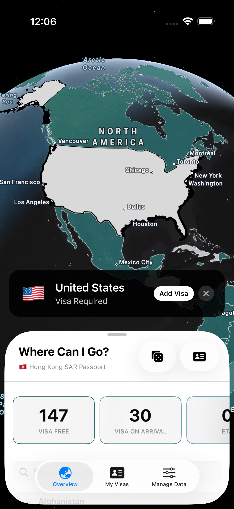
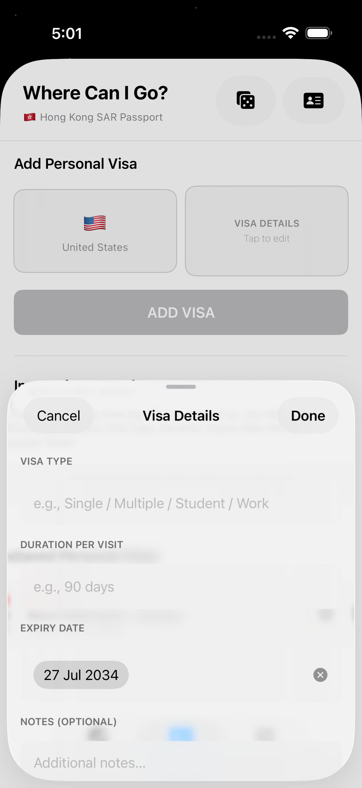
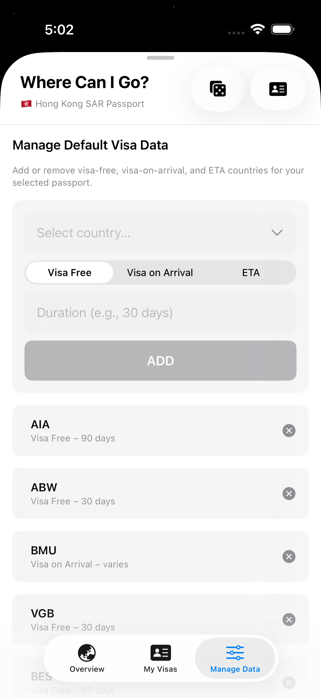

# where-can-i-go | 跟住去邊度

An interactive visa-availability tracker for visualizing global travel accessibility with a dynamic map and customizable data.

## Overview

`where-can-i-go` is a lightweight application (currently iOS only, later may expand to Android and Web Application) that helps users explore which countries are accessible based on selected passport and visa policy data. The app visualizes country-level visa rules on a world map, provides details per country, and includes tools for importing or editing local datasets for research and personal planning.

## Screenshots

| Main View | My Visas | Manage Data |
|:---:|:---:|:---:|
|  |  |  |
| Screenshot: Main view | Screenshot: My Visas Tab | Screenshot: Manage Default Entry Policy Data |

## Features

- **Interactive Map:** Pan and zoom the world map to discover travel accessibility. Tap the countries on the map to see accessibility info.
- **Overview Tab:** Quick summary and visa requirements for selected countries.
- **Passport & Visa Presets:** Select your passport to filter accessible destinations.
- **Random Place To Go:** Hit the dice button and the app will select an accessible country for you to be your next travel destination.
- **Add Visa:** Add your personal visa(s) in the app and manage them.
- **Offline-capable Data:** Uses bundled resources in the app bundle for fast lookup.
- **Manage Default Data:** In case the JSON files are not up-to-date, you may edit visa-free/ETA/Visa-On-Arrival based on the latest policy related to your passport.

## Getting Started (iOS)

1. Clone the repository:

```
git clone https://github.com/marc0cheung/where-can-i-go.git
```

2. Open the Xcode workspace `whereCanIGo.xcodeproj`.

3. Build and run on a simulator or device (iOS target supported in project file).

4. Data files are located in `whereCanIGo/Resources/`:

- `countries.json` — country metadata used by the UI.
- `default_visas_HKG.json` — example visa defaults for Hong Kong passport.
- `world-countries.geojson` — geometry for map rendering.

To modify data, edit the JSON files and rebuild the app.

## Data & Attribution

The repository includes sample and geometric datasets bundled under `whereCanIGo/Resources/`. If you add external data sources, please note their licenses and include attribution in this README.

## Contributing

Contributions are welcome. Please open issues for feature requests or bugs and submit pull requests with clear descriptions and small, focused changes.

Guidelines:

- Fork the repo and create a feature branch.
- Keep changes focused and include tests or screenshots if relevant.
- Update this README or `Resources/` notes if you change data formats.

## Current Known Issues
- The application is iOS only now.
- Travel Policy for the listed passports are not accurate, and need to add more supported passports with correct and up-to-date data.
- The area coverage of each country is NOT accurate to maintain the map rendering performance.
- For selected country, the border lines thickness are not the same.
- (iOS) Only supports iOS 26 or above. Currently iPadOS may experience UI issues. 

## Feature Backlog
- Integrate "Manage Data" tab with "Overview" tab
- Upload photos / scanned copies of visa pages
- Detect (with GPS permission ON) & save visited countries
- Shareable cards: Export a country's visa summary / visited countries as an image
- Filter function on Overview Tab
- Multiple passport(s) support
- Multiple languages support

## License

This project is licensed under the terms in the `LICENSE` file.

## Contact

If you have questions or want to collaborate, open an issue or contact the maintainer listed in the repository.